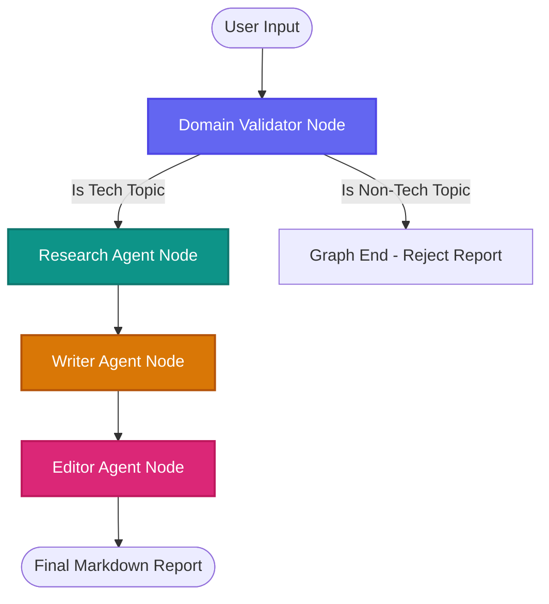

# Antigravity Multi-Agent Research Orchestrator

A modern web application that uses a three-agent LangGraph workflow to generate high-quality technology market research reports.

## Features
- **Strict Domain Validation**: Only allows requests related to technology (AI, cloud, cybersecurity, emerging tech, programming, etc.). Politely rejects other requests.
- **Three-Agent Workflow**:
  - **Research Agent**: Gathers facts, statistics, and builds conceptual notes.
  - **Writer Agent**: Converts notes into a structured professional report (9 custom sections).
  - **Editor Agent**: Reviews grammar, tone, flow, and formatting for a clean final output.
- **Real-Time Streaming UI**: Server-Sent Events (SSE) stream logs and state updates, displaying progress indicators, live terminal-like consoles, and stopwatch timings.
- **Rich Aesthetics**: Custom dark/light mode, technology grid layouts, subtle micro-animations, glow decorations, and print-ready styles.
- **Comprehensive E2E Test Suite**: Tests the entire system (backend state transitions, frontend components, and Playwright-driven browser interactions) and generates a unified report.
- **LangSmith Tracing**: Standard node-level tracing and observability.

---

## Overall Architecture



### State Definition (`GraphState`)
All agents communicate via a shared typed state in `backend/state.py`:
- `user_query` (str): The initial query entered by the user.
- `research_notes` (Optional[str]): Bullet point data compiled by the Researcher.
- `draft_report` (Optional[str]): Draft compiled by the Writer.
- `final_report` (Optional[str]): Polished markdown compiled by the Editor.
- `status` (str): Workflow position (`validating`, `researching`, `writing`, `editing`, `completed`, `failed`).
- `errors` (Optional[List[str]]): Collection of validation rejection or runtime error messages.

---

## Project Structure

```text
├── backend/
│   ├── app.py                # FastAPI web server (sync & SSE endpoints)
│   ├── config.py             # Config parser (Pydantic Settings)
│   ├── state.py              # Typed LangGraph state definition
│   ├── prompts.py            # System prompts for all agents
│   ├── agents.py             # LangChain model and agent invocation wraps
│   ├── graph.py              # Compiled LangGraph state machine definition
│   ├── test_graph.py         # Backend local integration tests
│   └── requirements.txt      # Python dependencies
├── frontend/
│   ├── src/
│   │   ├── components/       # UI elements (WorkflowProgress, LogConsole, ReportViewer, SamplePrompts)
│   │   ├── services/         # API Service (Fetch stream parser, Axios client)
│   │   ├── types/            # TypeScript interfaces (type-only exports)
│   │   ├── App.tsx           # Layout, dark mode, SSE integrations, stopwatch
│   │   ├── main.tsx          # Render entrypoint
│   │   └── index.css         # Styling, glassmorphic helpers, print styles
│   ├── tailwind.config.js    # Tailwind configuration (typography & custom colors)
│   ├── package.json          # Vite frontend dependencies
│   └── index.html            # Core HTML entrypoint (SEO best practices tags)
├── tests/
│   └── test_e2e.py           # E2E browser tests (Playwright)
├── run_tests.py              # Automated test suite runner (spins up servers & merges logs)
├── .env.example              # Variables template file
└── test_results.md           # Consolidated test execution report
```

---

## Configuration & Environment Variables

Create a `.env` file in the root directory based on `.env.example`:

```bash
# OpenAI Configuration
OPENAI_API_KEY=your_openai_api_key_here
OPENAI_MODEL=gpt-4o-mini

# LangSmith Tracing and Observability (Optional)
LANGCHAIN_TRACING_V2=true
LANGCHAIN_API_KEY=your_langchain_api_key_here
LANGCHAIN_PROJECT=multi-agent-tech-reports
```

*Note: If no `OPENAI_API_KEY` is provided, the application automatically runs in **Mock Mode** utilizing mock agent outputs. This allows full interface, stream, and E2E testing without calling the paid API.*

---

## Installation Commands

### 1. Backend Dependencies
```bash
pip install -r backend/requirements.txt
```

### 2. Frontend Dependencies
```bash
cd frontend
npm install
cd ..
```

---

## Running Locally

To run the application, start both the backend FastAPI server and the frontend React server.

### Start Backend Server
```bash
uvicorn backend.app:app --port 8000 --reload
```
API endpoints will be exposed at:
- Swagger Documentation: `http://localhost:8000/docs`
- Health Check: `http://localhost:8000/health`
- Streaming Generation Endpoint: `POST http://localhost:8000/generate-report/stream`

### Start Frontend Server
```bash
cd frontend
npm run dev -- --host 127.0.0.1
```
Open your browser and visit: `http://127.0.0.1:5173/`

---

## Running the Automated Test Suite

We provide a test runner `run_tests.py` that will install Playwright Chromium, launch both backend and frontend servers in the background, run backend tests, run the E2E browser integration tests, shut down the servers, and output `test_results.md`.

Run it from the root directory:
```bash
python run_tests.py
```

---

## Future Improvements
1. **Dynamic Search Tool Integration**: Bind Google Search or Tavily to the Research Agent to retrieve live, up-to-the-minute tech market pricing and updates.
2. **Editor Feedback Loops**: Add a conditional router edge that sends feedback from the Editor back to the Writer if requirements are not fully met (adding iterative loops to the graph).
3. **Structured PDF Downloads**: Utilize CSS paged media rules to customize headers, footers, and page numbers when clicking the PDF download button.
